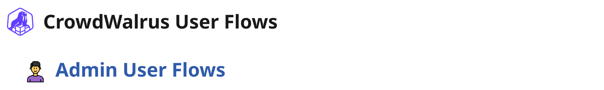
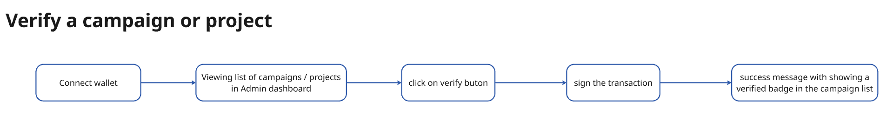
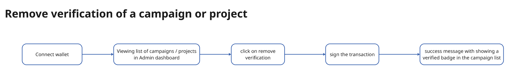
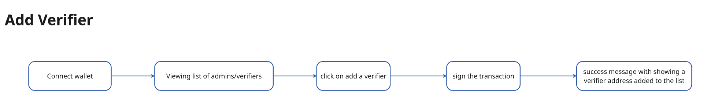

### Overview
Admins in the CrowdWalrus platform are responsible for overseeing and verifying projects and campaigns. Their tasks involve reviewing submitted content, making sure about legitimacy of the project, and ensuring the platform's integrity. When a project or a campaign get verified by admins, they got a "Verified Badge". Below is a breakdown of the key user flows for admins.

#### **1. Verify Project or Campaign**
- **Description**: The admin has the ability to verify projects or campaigns to give them official recognition on the platform.
- **Flow**:
  - Admin selects a project or campaign that reviewed and seems to be ligit.
  - Admin verifies the project, which then gets a verification badge.
  - The project or campaign becomes eligible to appear on the platform's homepage.
  - 

#### **2. Unverify Project or Campaign**
- **Description**: Admins can unverify projects or campaigns, removing the verified badge and eligibility for featured placement.
- **Flow**:
  - Admin selects the verified project or campaign. This happens whem teh campaign violated the rules of teh CrowdWalrus platform. 
  - Admin removes the verification, which causes the badge to be removed. Project can't be removed because of the decentralization nature, but it will be unlisted from the hompage of the platform where are proejcts are listed. 
  - The project or campaign is no longer displayed as a verified entity.

#### **3. Add a verifier**
- **Description**: Admins can also nominate other verifiers, which are fundamental to our goals of decentralizing our project review system.
- **Flow**:
  - Admin can see list of reviewers.
  - Admin add an address as a reviwer in the input.

These admin user flows ensure that CrowdWalrus maintains a high standard of project and campaign quality, allowing admins to manage verification status while supporting transparency and accessibility in the crowdfunding ecosystem.

