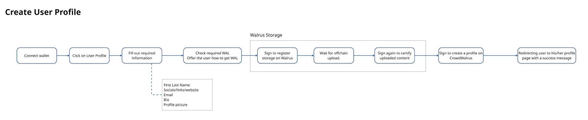
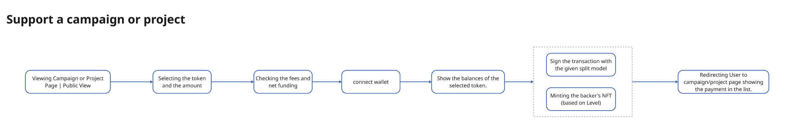

# Backer/Donor User Flows

## Overview
These user flows describe the steps a Backer/Donor follows on the CrowdWalrus platform, from profile creation to making donations. The flows ensure a smooth and transparent process for contributors, enabling them to donate to campaigns and projects effortlessly. Each flow is designed to integrate seamlessly with decentralized technologies, providing transparency and accessibility.

## 1. **Profile Creation Flow**

- **Description**: A Backer/Donor creates a profile on the CrowdWalrus platform. This profile allows the user to track donations, view campaigns and projects, and participate in the fundraising ecosystem. The flow includes wallet connection and user verification.

## 2. **Donation Flow**

- **Description**: The donation flow guides the Backer/Donor through the process of selecting a project or campaign to donate to, choosing the amount, and confirming the donation using their wallet. This flow is optimized for Web3 integration, ensuring a decentralized and transparent donation experience.
