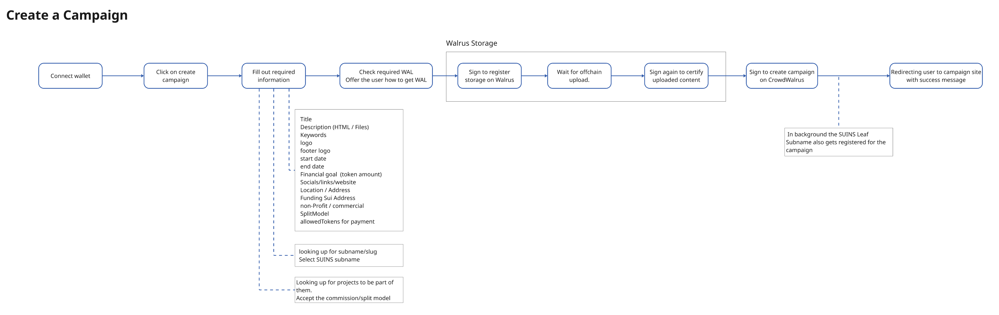
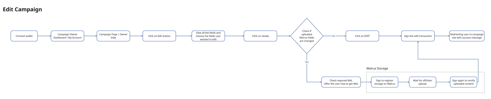
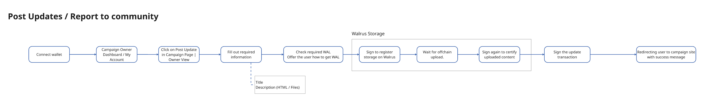
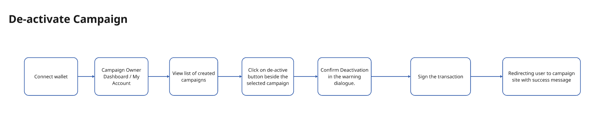
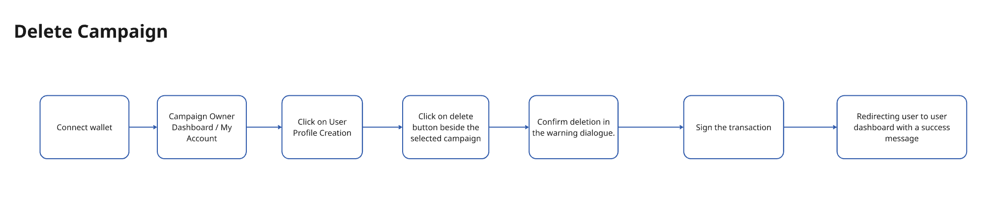

## Overview

These are the key user flows for Campaign Owners within the CrowdWalrus platform. Each flow allows Campaign Owners to perform specific tasks such as creating campaigns, editing, posting updates, deactivating or deleting their campaigns, and managing their profiles.

---

## 1. Create a Campaign

**Description**: This flow allows Campaign Owners to create a new campaign. The user submits necessary details like title, description, financial goals, and images. A subdomain is automatically assigned, and the campaign is registered on the platform.

---

## 2. Edit a Campaign

**Description**: After creating a campaign, the Campaign Owner can edit the details, such as modifying the campaign’s description, updating financial goals, or changing images. This allows for ongoing management and optimization of the campaign.

---

## 3. Post an Update

**Description**: This flow enables the Campaign Owner to post updates about their campaign, keeping backers informed on the progress and any new developments. Updates are visible on the campaign page.

---

## 4. Deactivate a Campaign

**Description**: If needed, a Campaign Owner can deactivate their campaign, which removes it from being active on the platform. This may be necessary if the campaign is no longer running or has achieved its goal.

---

## 5. Delete a Campaign

**Description**: This flow allows the Campaign Owner to delete their campaign permanently from the platform. Once deleted, all associated data and content will be removed from the system.

