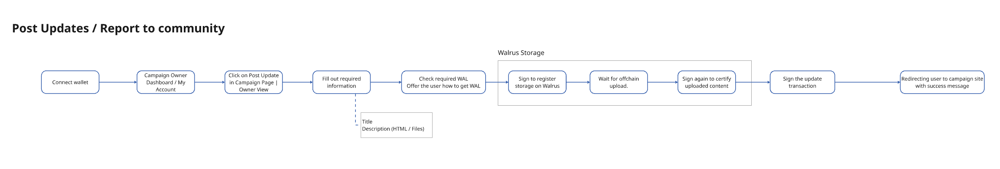

# Project Moderator User Flows

## 1. Create Campaign
- **Flow**: A Project Moderator can create new campaigns under existing projects, providing necessary details such as campaign name, financial goal, and timeline. This also involves setting up donation targets.
- **Description**: Enables the creation of new fundraising campaigns for ongoing projects, allowing moderators to facilitate fundraising efforts efficiently.

## 2. Unlink Campaign from Project
- **Flow**: A moderator can unlink a campaign from a project if needed. This may be done due to project changes or misalignment with the campaign's goals.
- **Description**: Provides flexibility in managing project-campaign relationships, ensuring that campaigns are correctly linked or unlinked as required.

## 3. Linking Campaign to Project
- **Flow**: The moderator can link a campaign to an existing project. This includes verifying that the campaign aligns with the project goals and community guidelines.
- **Description**: Ensures the seamless connection of campaigns to the appropriate projects, enabling backers to donate with confidence.

## 4. Campaign Update
- **Flow**: A moderator can view existing campaigns, edit them if required, and publish updates. Updates can include text, images, or changes to campaign goals.
- **Description**: This ensures campaigns are kept up to date, improving transparency and user engagement.

## 5. Profile Management
- **Flow**: The Project Moderator logs into the system, views their profile, and can edit or update personal information as needed. This ensures they have control over their account details and settings.
- **Description**: Allows moderators to view and manage their personal details, ensuring smooth communication and engagement on the platform.

