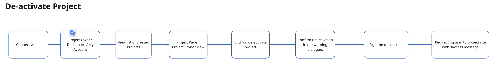
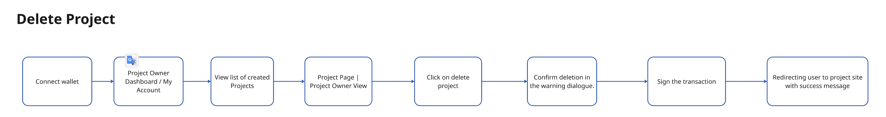

### Overview

The project owner user flows provide a comprehensive and secure process for managing projects and campaigns on the platform. These flows include creating and editing projects, adding or removing moderators, and creating or unlinking campaigns under projects. Additionally, project owners can post updates, manage user profiles, and de-activate or delete projects when necessary. Each action requires wallet connectivity and transaction signing, ensuring secure and decentralized management of projects. The flows also involve creating SUINS subnames for projects and campaigns, maintaining a seamless interaction between on-chain and off-chain data.

## 1. Create a Project
- **Description**: The project owner connects their wallet, fills out the necessary project information like title, description, and funding requirements, registers the project, and signs the transaction. In the background, a SUINS leaf subname is also registered for the project.

---

## 2. Edit Project
- **Description**: The project owner connects their wallet, clicks on the edit button for a project, views and chooses the fields they want to edit, and if any changes to Walrus storage are made, signs the transaction. The user is redirected to the project site with a success message.

---

## 3. Add/Remove Moderators
- **Description**: The project owner connects their wallet, views the created projects, and adds or removes moderators as needed. The user signs the transaction and is shown a success message.

---

## 4. Create Campaign under the Project
- **Description**: The project owner connects their wallet, clicks to add a campaign under the existing project, and fills in required campaign details like title, description, funding amount, and more. The user registers the campaign and signs the necessary transactions, including creating a SUINS subname for the campaign.

---

## 5. Accept/Reject to Host a Campaign
- **Description**: The project owner connects their wallet, views the campaign requests, and chooses whether to accept or reject hosting the campaign. After signing the transaction, the user is presented with a success message.

---

## 6. Unlink a Hosted Campaign
- **Description**: The project owner connects their wallet, views their hosted campaigns, and selects the campaign they wish to unlink. After accepting the warning modal and signing the transaction, the system displays a success message.

---

## 7. Post Updates / Report to Community
- **Description**: The project owner connects their wallet, accesses the campaign dashboard, and fills out the required information for posting updates, such as title and description. They sign the transaction, upload the offchain content, and are redirected to the campaign site with a success message.

---

## 8. Create User Profile
- **Description**: The user connects their wallet, clicks on the User Profile section, and fills out the required personal information, such as name, email, and social links. They also confirm the required WAL and go through the offchain upload process to complete their profile.

---

## 9. De-activate Project
- **Description**: The project owner connects their wallet, accesses the project dashboard, views their created projects, and selects the project to deactivate. They confirm the deactivation in a warning dialogue, sign the transaction, and are redirected to the project site with a success message.

---

## 10. Delete Project
- **Description**: The project owner connects their wallet, navigates to the project dashboard, views their created projects, and selects the project they want to delete. They confirm the deletion in a warning dialogue, sign the transaction, and are redirected to the project site with a success message.

---
