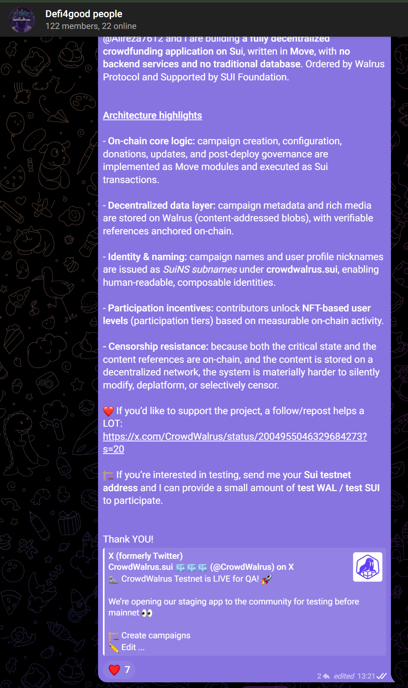

# CrowdWalrus UX QA 🧪

Inviting external users to participate in UX testing comes with several practical challenges. Testers often require **WAL or Sui testnet tokens** to interact meaningfully with the dApp, which introduces additional operational friction. There is also a natural **trust barrier**: many users are understandably hesitant to connect their wallets to unfamiliar dApps due to security concerns.

Additionally, some potential testers were not yet onboarded into the **Sui ecosystem** and first needed to install a compatible wallet and complete initial setup before they could begin testing.

The QA phase also kicked off **close to the Christmas and year-end holiday period**, which naturally reduced user availability and responsiveness and had a measurable impact on live user testing velocity. Despite this timing constraint, we adopted a dual approach—**public community invitations** combined with **direct and cold outreach** to individuals and teams.

---

## 📊 QA Outcomes & Scale

This approach proved effective. During the QA period, we recorded:

- 🧩 **Nearly 400 test campaigns created**
- 🔁 **Hundreds of campaign interactions**
- 👥 **Over 2,000 new user test sign-ups**

These results provided strong real-world usage signals across all core user flows and validated the platform under realistic conditions.

A brief report below outlines the execution and outcomes from both **public announcements** and **targeted outreach efforts**.

---

## 📣 Public QA Kickoff Announcements

### 🐦 CrowdWalrus X (Twitter)
Primary public QA announcement  
🔗 https://x.com/CrowdWalrus/status/2004955046329684273

**Results:**
- 730 impressions  
- 32 likes, 17 reshares  
- 3 users directly reported bugs (via replies and GitHub)

---

### 💬 Walrus Discord
- **RFP channel**  
  🔗 https://discord.com/channels/946098997637042178/1415695976487845898/1452720914352570539
- **Content channel**  
  🔗 https://discord.com/channels/946098997637042178/1343299049989603461/1455508346567393453

---

### 🧠 Sui Discord
- **Dev-showcase channel**  
  🔗 https://discord.com/channels/916379725201563759/969317349343785020/1455470934566637731
- **Content channel**  
  🔗 https://discord.com/channels/916379725201563759/968390502007341066/1455476178558255155

---

### 🌐 SuiNS Discord
- **Content-zone**  
  🔗 https://discord.com/channels/1014945398084870245/1024899660529274900/1455845886398697597

---

### 🐘 CrowdWalrus Discord
- QA announcement and follow-up discussion  
  🔗 https://discord.com/channels/1449989958831181876/1449993485976469700/1454759686929907722

---

## 👥 Private Group Outreach

### 🤝 DeFi for Good — Private Group Chat
- More than **60 real user engagements**

---

### 🌱 Funding the Commons — Community Group
- ~800 members from the web3 philanthropy ecosystem

---

### ☕ DeCafeth — Web3 Builders Community

---

### 🌍 Additional Community Groups
- Giveth-Galaxy and related group chats  
- Some screenshots cannot be shared due to privacy  
- Several groups operate in local (non-English) languages

---

## 🎯 1:1 Outreach & Direct Testing Sessions

### 🧪 Organized Test Sessions
- [Griff Green — Test Party](Griff%20Green%20-%20Test%20Party%202ea3ab28d48c8066bff0f8f13411d404.md)

---

### 👤 Individual Tester Examples

#### **Zepti**

https://www.notion.so

---

#### **Jake**

---

#### **Mateo**

---

#### **Devansh**

---

### ❄️ Cold Outreach at Scale
- More than **50 direct cold outreach messages**
- ~**90% response or reaction rate**

---

🔗 [Griff Green — Test Party](Griff%20Green%20-%20Test%20Party%202ea3ab28d48c8066bff0f8f13411d404.md)
